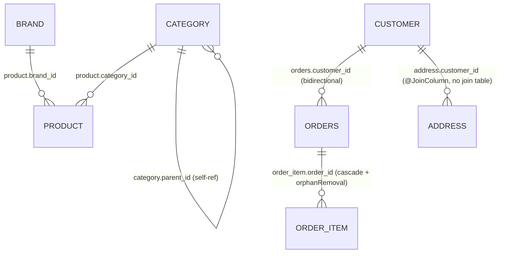

# 04 — Many-to-One & One-to-Many

> Proven by [`ManyToOneTest`](../src/test/java/com/example/jpatraining/manytoone_onetomany/ManyToOneTest.java),
> [`BidirectionalOneToManyTest`](../src/test/java/com/example/jpatraining/manytoone_onetomany/BidirectionalOneToManyTest.java),
> [`CascadeOrphanRemovalTest`](../src/test/java/com/example/jpatraining/manytoone_onetomany/CascadeOrphanRemovalTest.java),
> [`SelfReferentialTest`](../src/test/java/com/example/jpatraining/manytoone_onetomany/SelfReferentialTest.java),
> [`UnidirectionalOneToManyJoinColumnTest`](../src/test/java/com/example/jpatraining/manytoone_onetomany/UnidirectionalOneToManyJoinColumnTest.java).

The bread-and-butter relationship. A **ManyToOne** is always the **owning** side and holds the FK
(it's on the "many" row — many orders point at one customer). A **OneToMany** is its mirror; mapped
bidirectionally it is the **inverse** side (`mappedBy`).



---

## 1. ManyToOne — `Product → Brand`

The FK is on the many side; the association is a lazy proxy.

```java
@ManyToOne(fetch = FetchType.LAZY)
@JoinColumn(name = "brand_id")
private Brand brand;
```

`manyToOne_isLazyProxyUntilTouched`: loading a `Product` is **1 select** (brand and category are
proxies); touching `product.getBrand().getName()` adds **exactly 1** select.

---

## 2. Bidirectional OneToMany/ManyToOne — `Customer ↔ Order` (the default)

Owning side `Order.customer` holds the FK; `Customer.orders` is the inverse.

```java
// Order (owning)
@ManyToOne(fetch = FetchType.LAZY)
@JoinColumn(name = "customer_id")
private Customer customer;

// Customer (inverse)
@OneToMany(mappedBy = "customer", fetch = FetchType.LAZY)
private List<Order> orders = new ArrayList<>();

// Customer keeps both sides in sync via an owning-side-aware helper
public void addOrder(Order order) { orders.add(order); order.setCustomer(this); }
```

```sql
create table orders (
    customer_id bigint,                 -- FK, NOT unique => many orders per customer
    id bigint not null,
    shipment_id bigint unique,          -- (the OneToOne from chapter 03, contrast: unique)
    order_number varchar(255) not null unique,
    primary key (id)
)
```

`owningSide_orderHoldsTheForeignKey`: because the FK lives on `orders`, given an `Order` the
**customer id is free** (`+0` selects) — only initializing the full customer entity costs a query.

---

## 3. N+1 — the headline pitfall

`nPlusOne_iteratingOrdersPerCustomer_isFixedWithJoinFetch` proves it by counting **collection loads**:

```java
// BAD: 1 query for customers, then 1 orders-query PER customer
List<Customer> customers = em.createQuery("select c from Customer c where ...", Customer.class).getResultList();
for (Customer c : customers) c.getOrders().size();   // +1 collection query each  => N+1
```

| Scenario | Orders-collection queries while iterating |
|---|---|
| Plain query, then touch `orders` | **N** (one per customer) — N+1 |
| `select distinct c from Customer c left join fetch c.orders` | **0** (fetched up front) |

The fix is to fetch eagerly **per query**, not per mapping:

```java
em.createQuery("select distinct c from Customer c left join fetch c.orders", Customer.class)
```

`@EntityGraph` on a Spring Data repository method does the same declaratively. (Real-world note: it's
often worse than a clean "N" — here each loaded `Order` also eager-resolves its inverse OneToOne
`payment` from chapter 03, so the raw statement count balloons further. Measuring *collection loads*
isolates the orders N+1; see the test comment.)

---

## 4. Parent–child: cascade + orphanRemoval — `Order ↔ OrderItem`

When children have no life outside their parent, cascade writes and remove orphans.

```java
@OneToMany(mappedBy = "order", cascade = CascadeType.ALL, orphanRemoval = true)
private List<OrderItem> items = new ArrayList<>();

public void addItem(OrderItem item)    { items.add(item); item.setOrder(this); }
public void removeItem(OrderItem item) { items.remove(item); item.setOrder(null); }
```

`order_item` is the owning side (holds `order_id`) and carries link attributes (`quantity`, an
embedded `Money unitPrice`) plus a `product_id` — i.e. it is the join **entity** between Order and
Product (revisited in chapter 05).

- `cascade_persistingOrderPersistsItems`: persisting the order alone persists both items.
- `orphanRemoval_removingItemFromCollectionDeletesIt`: removing one item from the collection issues
  **1 delete**, and the row is gone.

---

## 5. Self-referential — `Category` tree

The same entity on both ends: a ManyToOne `parent` and a OneToMany `children`.

```java
@ManyToOne(fetch = FetchType.LAZY) @JoinColumn(name = "parent_id")
private Category parent;
@OneToMany(mappedBy = "parent")
private List<Category> children = new ArrayList<>();
```

`parentIsLazyProxy_andChildrenAreLazyCollection`: `parent` is a lazy proxy (`+1` when touched), and
`children` is a lazy collection (`+1` when first iterated).

---

## 6. Unidirectional OneToMany with `@JoinColumn` — `Customer → Address`

A unidirectional `@OneToMany` **without** `@JoinColumn` would create a separate join table. Adding
`@JoinColumn` puts the FK on the child table instead — usually what you want:

```java
@OneToMany(cascade = CascadeType.ALL, orphanRemoval = true, fetch = FetchType.LAZY)
@JoinColumn(name = "customer_id")   // FK on the address table — NO join table
private List<Address> addresses = new ArrayList<>();
```

```sql
create table address (
    customer_id bigint,        -- FK lives here; there is no customer_addresses join table
    id bigint not null,
    city varchar(255), postal_code varchar(255), street varchar(255),
    primary key (id)
)
```

`joinColumn_collectionIsLazyAndLoadsInOneSelect`: the collection is lazy and loads with a single
select from `address`. (The join-table version, and its extra `UPDATE` statements, is dissected as
an anti-pattern in the common-problems chapter.)

---

## Best-practice summary

- **ManyToOne/OneToMany are `LAZY`.** The owning side is the ManyToOne (it holds the FK).
- **Map bidirectional with `mappedBy` on the OneToMany** and keep both sides in sync with an
  owning-side helper (`addX`/`removeX`).
- **Solve N+1 per query** with `JOIN FETCH` / `@EntityGraph` — never by switching the mapping to EAGER.
- **`cascade` + `orphanRemoval`** only for true parent–child (children with no independent lifecycle).
- **Unidirectional `@OneToMany` → add `@JoinColumn`** to avoid an accidental join table.

## Next

[05 — Many-to-Many](05-many-to-many.md): the join entity (`OrderItem`) vs. a pure `@ManyToMany`, and
why `Set` beats `List`.
