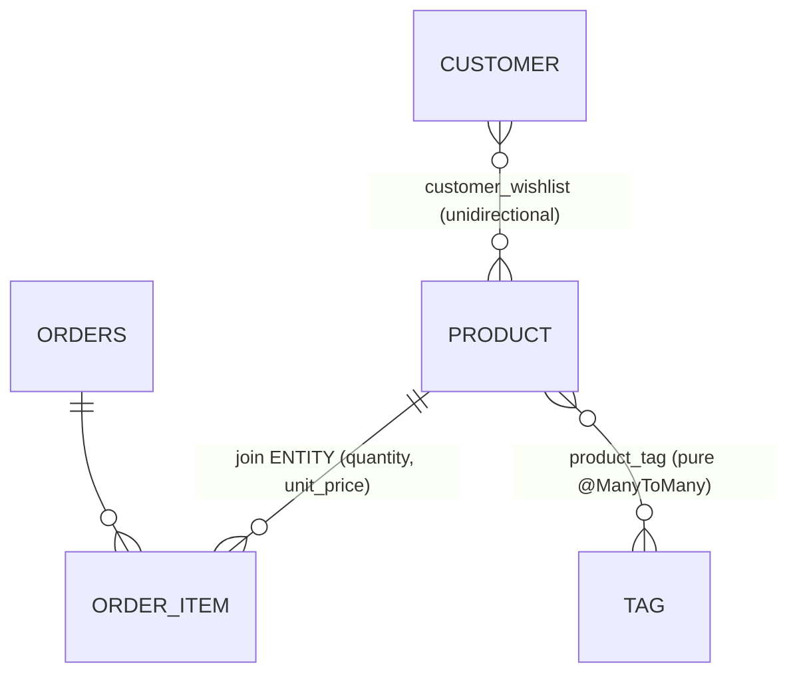

# 05 — Many-to-Many

> Proven by [`PureManyToManyTest`](../src/test/java/com/example/jpatraining/manytomany/PureManyToManyTest.java),
> [`UnidirectionalManyToManyTest`](../src/test/java/com/example/jpatraining/manytomany/UnidirectionalManyToManyTest.java),
> and [`JoinEntityManyToManyTest`](../src/test/java/com/example/jpatraining/manytomany/JoinEntityManyToManyTest.java).

A many-to-many always needs a **join table**. The first decision is whether that link carries data:

- **Link has attributes** (quantity, price, addedAt, …) → model it as a **join entity** (two
  ManyToOne).
- **Link is just a pair** → a **pure `@ManyToMany`** (Hibernate manages the join table for you).



---

## 1. Join entity (link with extra columns) — `Order ↔ Product` via `OrderItem`

When the relationship itself has data, a pure `@ManyToMany` can't express it. Model the link as an
entity with two `@ManyToOne`s and put the extra columns on it:

```java
@Entity
public class OrderItem {
    @ManyToOne(fetch = LAZY) @JoinColumn(name = "order_id")   private Order order;
    @ManyToOne(fetch = LAZY) @JoinColumn(name = "product_id") private Product product;
    private int quantity;
    @Embedded private Money unitPrice;   // the "extra columns"
}
```

`joinEntity_carriesLinkAttributes` shows the link data survives the round trip (quantity 2 + 1 = 3).
And `navigatingToProducts_isNPlusOne_fixedWithJoinFetch` proves the catch: walking
`order → items → product` lazily is **N+1** (one select per product), fixed by fetching both legs:

```java
select o from Order o join fetch o.items i join fetch i.product where o.id = :id
```

| Navigating an order's products | Selects |
|---|---|
| lazy (`item.getProduct()` per item) | **N** (one per item) |
| `join fetch o.items i join fetch i.product` | **0** extra |

---

## 2. Pure bidirectional `@ManyToMany` — `Product ↔ Tag`

No extra columns, so let Hibernate own the join table. **`Product` is the owning side** (it declares
the `@JoinTable`); `Tag` is the inverse (`mappedBy`). Use a `Set`.

```java
// Product (owning)
@ManyToMany(fetch = FetchType.LAZY)
@JoinTable(name = "product_tag",
           joinColumns = @JoinColumn(name = "product_id"),
           inverseJoinColumns = @JoinColumn(name = "tag_id"))
private Set<Tag> tags = new HashSet<>();

// Tag (inverse)
@ManyToMany(mappedBy = "tags")
private Set<Product> products = new HashSet<>();
```

```sql
create table product_tag (
    product_id bigint not null,
    tag_id bigint not null,
    primary key (product_id, tag_id)   -- pure link table: composite PK, no surrogate id
)
```

- `owningSide_tagsAreLazyAndLoadInOneSelect`: `product.getTags()` loads in **one** select.
- `inverseSide_productsAreLazyAndLoadInOneSelect`: the inverse `tag.getProducts()` likewise.
- `set_ignoresDuplicateLinks`: adding the same tag twice collapses to one link.

Maintain both ends with an owning-side helper:

```java
public void addTag(Tag tag) { tags.add(tag); tag.getProducts().add(this); }
```

---

## 3. Unidirectional `@ManyToMany` — `Customer → wishlist`

When only one side needs to navigate, map it on that side alone (no `mappedBy` anywhere):

```java
@ManyToMany(fetch = FetchType.LAZY)
@JoinTable(name = "customer_wishlist",
           joinColumns = @JoinColumn(name = "customer_id"),
           inverseJoinColumns = @JoinColumn(name = "product_id"))
private Set<Product> wishlist = new HashSet<>();
```

```sql
create table customer_wishlist (
    customer_id bigint not null,
    product_id bigint not null,
    primary key (customer_id, product_id)
)
```

`wishlist_isLazyAndLoadsInOneSelect`: the wishlist loads with a single select.

---

## Why `Set`, not `List`

For `@ManyToMany`, prefer `Set`:

- a link table models a **set of pairs** — duplicates are meaningless;
- with a `List` (bag), Hibernate often **deletes every join row and re-inserts** on any change, where
  a `Set` issues a single targeted insert/delete;
- it sidesteps the `MultipleBagFetchException` you hit when fetching two `List`s at once (covered in
  chapter 07).

> **equals/hashCode caveat.** Entities placed in a `Set` need careful `equals`/`hashCode` once they
> become detached. These tests run inside one persistence context (identity equality is consistent),
> so they don't need it yet; the business-key approach is dissected in chapter 07.

## Best-practice summary

- **Link carries data → join entity** (two `@ManyToOne`); **plain pair → `@ManyToMany`**.
- **Use `Set`** for `@ManyToMany`.
- **One owning side** (declares `@JoinTable`); the other is `mappedBy`. Keep both ends in sync with a
  helper.
- **All `LAZY`**; fetch a far side **per query** with `JOIN FETCH` / `@EntityGraph`.

## Next

[06 — Fetching strategies](06-fetching-strategies.md): `JOIN FETCH` vs `@EntityGraph` vs batch
fetching, and pagination with fetch.
